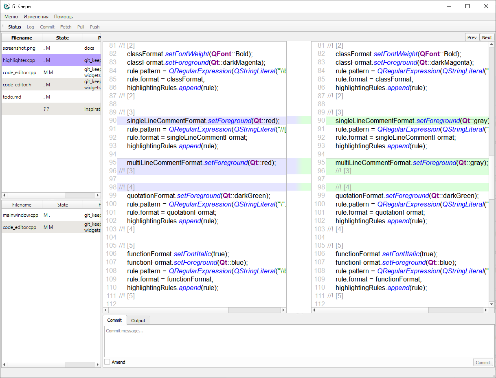

# GitKeeper
Git клиент на Qt-фреймворке.

Вдохновлён таким клиентом как [SmartGit](https://www.syntevo.com/smartgit/).

Основной фокус приложения -- показывать текущие изменённые файлы (результат команды `status`), быстро просматривать сами изменения, а так же добавлять их в индекс коммита или отменять.

## Скриншоты

## Особенности

* написан на C++ с использованием фреймворка Qt
* Отображает результаты команды `status`
* Показывает индекс коммита (пока нет)

## Требования и зависимости

* Десктопная операционная система, поддерживающая Qt
* Qt 5.14+
* gcc 4.9+

## Предупреждение

Проект ведётся в рамках хобби в свободное от работы или от иных мыслей время. Код не является стабильным. Возможны множественные ошибки, баги, недочёты, недоделанный функционал и прочие минусы разработки. Возможны частые и сильные изменения архитектуры в ходе рефакторинга. Другими словами, я не ограничиваю себя ничем. Делаю в первую очередь для собственного использования.

Основная разработка и тестирование ведётся в операционной системе Windows 10. Проверка работоспособности под остальные операционные системы не в приоритете.